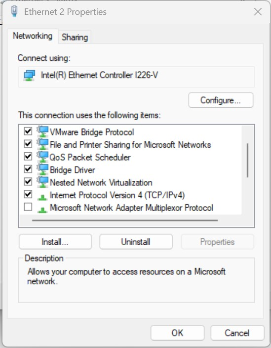
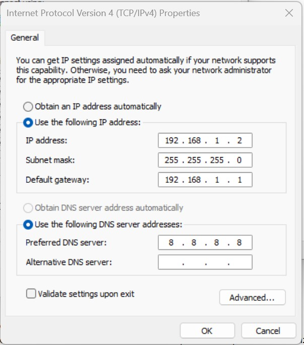

# Fysieke uFactory Lite robot

In dit hoofdtuk wordt beschreven hoe je een verbinding kunt opzetten tussen de development-computer en de fysieke robot.

## Netwerkverbinding opzetten
:::::::{card} 

::::::{tab-set}


:::::{tab-item} Windows: Rechtstreekse met een `cat5-kabel`
:::: {attention}
Gebruik deze optie als je een Virtual Machine gebruikt op je development-computer.
::::

Je kunt een rechtstreekse verbinding opzetten tussen de robot en development-computer door middel van een `cat5-kabel`. Kies deze optie als je geen andere apparaten in het netwerk wilt opnemen.

Je kunt in dit geval het ip-adres van de robot en development-computer handmatig instellen. Zorg ervoor dat je deveopment-computer een ip-adres krijgt in het subnet `192.168.1.x`.

Volg dez stappen voor het instellen van een statisch ip-adres op Windows:

Druk op Win + R, typ ncpa.cpl en druk op Enter.
1. Klik met de rechtermuisknop op je Ethernet adapter en kies Eigenschappen.
2. Selecteer Internet Protocol Version 4 (TCP/IPv4) en klik op Eigenschappen.
3. Kies "Het volgende IP-adres gebruiken":
1. IP-adres: 192.168.1.2
2. Subnetmasker: 255.255.255.0 (dit wordt automatisch ingevuld)
3. Standaardgateway: 192.168.1.1
4. Klik op OK.

De development-computer is nu geconfigureerd met een statisch ip-adres 192.168.1.2 in het subnet `192.168.1.x`.

::::{grid} 2
:::{grid-item-card} 

:::
:::{grid-item-card}

:::
::::

::::{tip}
Soms komt de netwerk verbinding niet tot stand, in dat geval kan het helpen om de netwerkverbindingen uit en weer aan te zetten. Je kunt ook proberen om de robot en development-computer te rebooten.
::::

:::::

:::::{tab-item} Linux: Rechtstreekse met een `cat5-kabel`
Je kunt een rechtstreekse verbinding opzetten tussen de robot en development-computer door middel van een `cat5-kabel`. Kies deze optie als je geen andere apparaten in het netwerk wilt opnemen.

je kunt in dit geval het ip-adres van de robot en development-computer handmatig instellen. Zorg ervoor dat je deveopment-computer een ip-adres krijgt in het subnet `192.168.1.x`.

Open op de development-computer de netwerkinstellingen:


Kies onder `wired` het tandwiel icoon en vervolgens `IPv4` tabblad. Kies hier voor `Manual` en vul de volgende gegevens in:
* IP-adres: 192.168.1.1 (je kunt ook een ander ip-adres kiezen, zolang deze maar in het subnet `192.168.1.x` ligt)
* Netmask: 255.255.255.0
* Gateway: 192.168.1.1


Sluit de instellingen.

::::{tip}
Soms komt de netwerk verbinding niet tot stand, in dat geval kan het helpen om de netwerkverbindingen uit en weer aan te zetten. Je kunt ook proberen om de robot en development-computer te rebooten.
::::

:::::

:::::{tab-item} Door middel van `router`

Je kunt een verbinding opzetten tussen de robot en development-computer door middel van een router. De router zorgt voor een stabiele verbinding tussen de robot en development-computer, en voorkomt interferentie met andere apparaten in het netwerk. Tevens kun je met een router ook andere apparaten in het netwerk opnemen zoals b.v. camera's of de teachbot

## Configuratie router
De router dient geconfigureerd te worden zodat het subnet `192.168.1.0` wordt. 
>Het instellen van de router valt buiten deze beschrijving en is router-type afhankelijk.

:::{tip}
Gebruik alleen de `LAN` poorten van de router, niet de `WAN` poort.
:::


:::::


::::::

:::::::


### Netwerkconfiguratie development-computer testen
Open een terminal en voer het volgende commando uit:
```bash
ifconfig | grep broadcast
```

Dit zal ongeveer dit resultaat opleveren:
```bash
    inet 192.168.1.1  netmask 255.255.255.0  broadcast 192.168.1.255
```

:::{note}
Controleer of het ip-adres in het juiste subnet opgenomen is `192.168.1.x`

Soms werkt dit commando niet goed, gebruik dan de methode `Testen communicatie met uFactory Lite6 robot` die verderop is beschreven.
:::

#### Robot besturen met je internet browser
Je kunt met je internetbrowser(Chrome/Firefox/Edge) naar een webpagina van de uFactory robot gaan en in de adresbalk het volgende web-pagina intypen
```
<robot-ip>:18333
```
Dit kan zowel onder Windows of je(virtule)Linux omgeving.

### Configuratie uFactory Lite robot
Verbind de uFactory Lite robot met het netwerk van de router met een `cat5-kabel` en voer de volgende handelingen uit op de teachpendant van de uFactory Lite robot

### Opvragen IP-adres van de uFactory Lite6 robot
Op de achterzijde van de uFactory Lite robot bevindt zich een sticker met daarop het serienummer van de robot. Op deze sticker staat ook het IP-adres van de robot vermeld. Noteer dit IP-adres, deze heb je later nodig.

## Testen communicatie met uFactory Lite6 robot
Je kunt de communicatie met de robot testen met het volgende commando:
```bash
ping <robot-ip>
```

Het resultaat moet dan hier op lijken
```text
PING <robot-ip> (<robot-ip>) 56(84) bytes of data.
64 bytes from <robot-ip>: icmp_seq=1 ttl=64 time=0.030 ms
64 bytes from <robot-ip>: icmp_seq=2 ttl=64 time=0.041 ms
64 bytes from <robot-ip>: icmp_seq=3 ttl=64 time=0.040 ms
^C
--- <robot-ip> ping statistics ---
3 packets transmitted, 3 received, 0% packet loss, time 2069ms

```

## Starten van de robot


```
ros2 launch my_uf_bringup real_robot.launch.py robot_ip:=<robot_ip>
```

Volg de output in de terminal en evalueer of er een goede connectie met de robot tot stand is gekomen.

RVIZ zal nu worden opgestart en een virtuele weergave van de robot-opstelling wordt nu zichtbaar. 
De stand van de robot in de virtuele wereld moet overeen komen met de stand van de uFactory Lite robot.

>Je kunt ook in het bestand `/<workspace>/src/my_ufactory_ROS2/my_uf_bringup/launch/real_robot.launch.py` het ip-adres wijzigen op regel 23.Daarna hoef je de robot_ip argument niet meer aan bovenstaande commando toe te voegen.

## Testen van de robot
Je kunt de robot nu laten bewegen door de ` movegroup`.

Je kunt de robot nu laten bewegen door het selecteren van een pose met de knop `Goal State` een positie kiezen en de weg naar de positie volgen met de `Plan` knop. Vervolgens kun je `Plan & Execute` of `Execute` bedienen waarna de robot zal bewegen naar de gekozen pose.

:::{danger}
Zorg ervoor dat de robot vrijelijk kan bewegen en geen obstakels tegen komt.
:::


