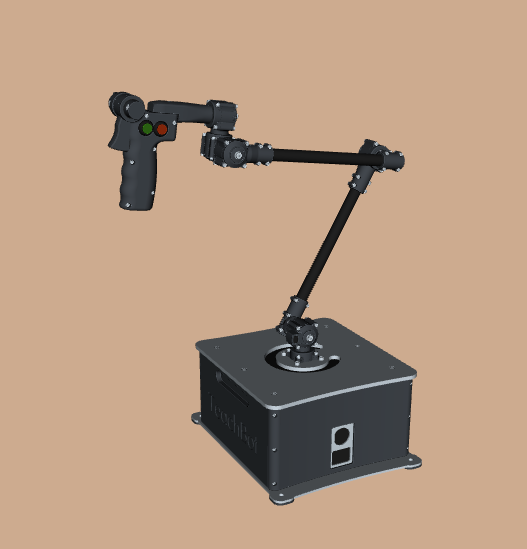

# TOS-Teachbot


**TeleOperation Services B.V.**

Met de TOS-Teachbot kun je met een teleoperatie de joints van de uFactory Lite6 robot bewegen.

   

## Voorbereidingen
Instaleer de Techbot software vogends de [handleiding van Teachbot](https://avansmechatronica.github.io/teachbot/)

## Starten van de uFactory Lite Robot

Je kunt de teleoperatie op de robot zowel in simulatie als met een fysieke(Realworld) UR robot uitvoeren

:::::{card} 

::::{tab-set}

:::{tab-item} Realworld

Start de robot:
```bash
ros2 launch my_uf_bringup real_robot.launch.py
```

Start de movegroup:
```bash
ros2 launch my_uf_bringup movegroup.launch.py
```

:::

:::{tab-item} Simulatie

Start de simualtie:
```bash
ros2 launch my_uf_bringup real_robot.launch.py
```

Er wordt de Gazebo simulatie omgeving voor een UR5 robot geopend en een RVIZ monitor. Vanuit de RVIZ monitor kun je door middel van de real_robot movegroup de robot laten bewegen naar voor ingestelde posities.


:::

::::

:::::

## Starten van de TOS-Teachbot
Ook de Teachbot kun ook in simulatie uitvoeren:
:::::{card} 

::::{tab-set}

:::{tab-item} Realworld


```bash
ros2 launch teachbot_ros teachbot_rviz.launch.py target_config_file:=~/teachbot_ws/src/teachbot_ros/teachbot_ros/config/target_robots/ufLite6.yaml
```
> Er zal een tweede RVIZ-monitor gestart worden met daarin een Teachbot device welke de stand van de Teachbot representeerd

:::

:::{tab-item} Simulatie

```bash
ros2 launch teachbot_ros sim_teachbot_rviz.launch.py target_config_file:=~/teachbot_ws/src/teachbot_ros/teachbot_ros/config/target_robots/ufLite6.yaml
```

:::

::::

:::::

## Starten van de jointfollower
```bash
ros2 launch teachbot_follower follower_action.launch.py config_file:=~/teachbot_ws/src/teachbot_ros/teachbot_follower/config/ur.yaml
```
Nadat je de Teachbot hebt ge-enabled zal de robot de bewegingen van de Teachbot in real-time volgen en uitvoeren.
